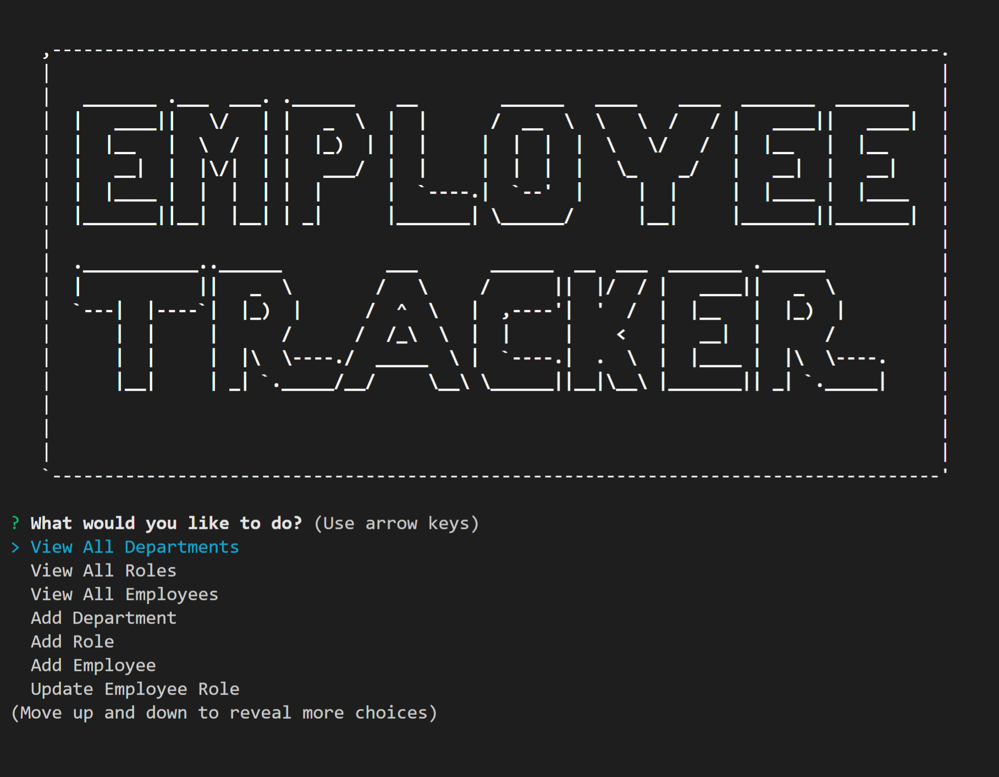
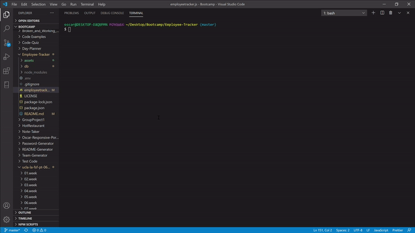

# Employee-Tracker

## Description

Employee Tracker is a node CLI application containing an employee database that tracks all the employees,roles and departments withing a company. The application will prompt the user various choices such as view all employees, view all departments, view all roles, update an employee, etc.

## Table of contents

- [Description](#Description)
- [Installation](#Installation)
- [Usage](#Usage)
- [License](#License)
- [Contributors](#Contributors)
- [Test](#Test)
- [GitHub Info](#Questions)

## Installation

Install the depencies in the package.json:

```
npm install

```

Then run the application:

```
npm start

```

## Usage

This application will allow the user to update and keep track of their company employees,roles and departments.

Screenschot



Example of HTML Generated:



## License


## Contributors

No contributing guidelines

## Test

No test required

## Questions

For questions contact ooledezma@gmail.com.
GitHub URL: https://api.github.com/users/ooledezma
